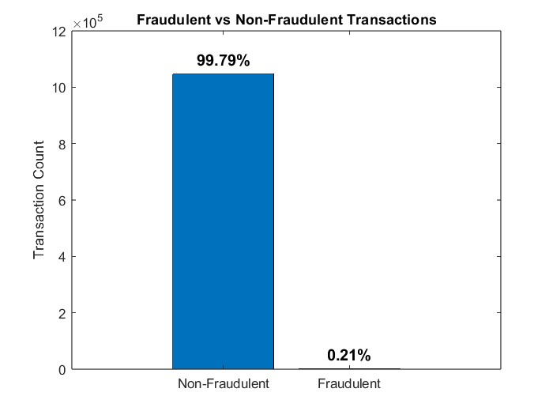
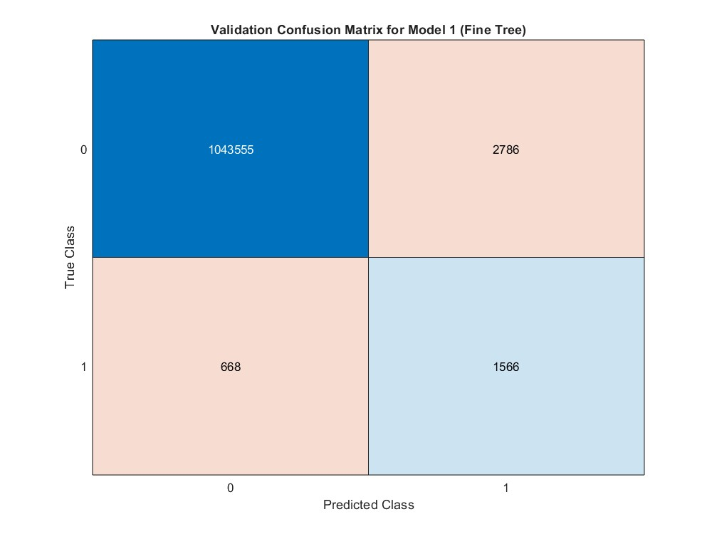
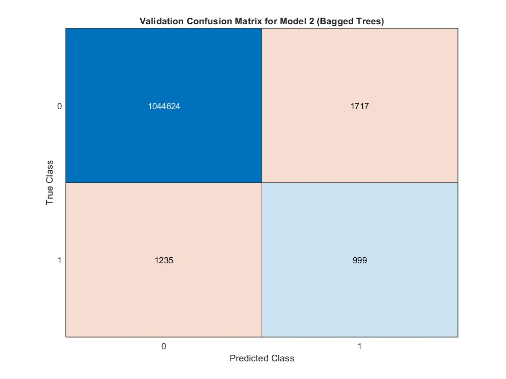

# Banking Fraud Detection System


A SQL Server and MATLAB-based system for detecting fraudulent transactions using machine learning.

## 📌 Key Features
- **Database Design**: ER diagram (Crow's Foot notation) for Users, Cards, Transactions, and Merchants
- **Data Analysis**: MATLAB visualizations of fraud patterns (0.21% fraud rate)
- **ML Models**: Decision Tree, Random Forest, RUSBoost with custom cost matrices
- **Performance**: Optimized for imbalanced datasets (99.79% are non-fraudulent transactions)

## 🗂️ Directory Structure
Banking-Fraud-Detection/
├── database/                  # SQL scripts and ER diagrams
├── matlab/                    # Data analysis and visualization scripts
│   ├── data_analysis.m        # Main analysis script
│   ├── classification.m       # ML model training
│   └── plots/                 # Generated visualizations
├── models_classification/     # Trained models (Git LFS tracked)
│   └── ClassificationLearnerSession.mat
├── docs/                      # Project documentation
│   ├── ER_diagram.pdf         # Database schema
│   └── analysis_report.pdf    # Full findings
└── README.md                  # Project overview

## 🛠️ Setup Instructions

### Database Setup
1. Run SQL scripts in `database/` to create tables
2. Import data from [Kaggle dataset](https://www.kaggle.com/datasets/computingvictor/transactions-fraud-datasets)

## 🔍 Database Access
MATLAB script for querying and analyzing SQL Server data:

### `sql_manipulations.m`
```matlab
%% Establish Connection
conn = database('SQLEXPRESS_odbc','','');  % Uses DSN 'SQLEXPRESS_odbc'

%% Query Transactions Table
queryTransactions = ['SELECT * FROM bank_transactions.dbo.Transactions'];
transactionsData = fetch(conn, queryTransactions);
disp(head(transactionsData));  % Preview first rows

%% Analyze Card Data
queryCards = ['SELECT * FROM bank_transactions.dbo.Cards'];
cardsData = fetch(conn, queryCards);
uniqueDarkWeb = unique(cardsData.card_on_dark_web);
fprintf('Dark web status categories: %d\n', numel(uniqueDarkWeb));

%% Close Connection
close(conn);
```

## 🔍 Key Findings

### Fraud Distribution
  
*Figure 1: Only 0.21% of transactions were fraudulent (highly imbalanced dataset)*

### Transaction Patterns
| Pattern                  | Fraudulent Rate | Example Categories               |
|--------------------------|-----------------|-----------------------------------|
| **High-Value Purchases** | 12.7%           | Electronics, Jewelry              |
| **Dark Web-Linked Cards**| 23.4%           | Stolen card credentials           |
| **Chip Transactions**    | 1.8%            | Physical card present transactions|

## 🔍 Model Validation Performance (K-Fold CV)

### Fraud Detection Metrics
| Model          | Recall | Precision | FP Rate | F1-Score |
|----------------|-------:|----------:|--------:|---------:|
| Decision Tree  | 33.2%  | 38.0%     | 0.096%  | 0.35     |
| Random Forest  | 44.7%  | 36.8%     | 0.16%   | 0.40     |
| **RUSBoost**   | **90.9%** | **7.7%** | **2.34%** | **0.14** |

### Confusion Matrices
  
*Figure 1: Decision Tree (Recall: 33.2%, FP Rate: 0.096%)*

  
*Figure 2: Random Forest (Recall: 44.7%, FP Rate: 0.16%)*

  
*Figure 3: RUSBoost (Recall: 90.9%, FP Rate: 2.34%)*

## 🚀 Deployment Recommendation

### **Recommended Model: RUSBoosted Ensemble** 
 *Advantages:*

- Catches 91% of fraud (3× better than Random Forest)
- Prevents estimated $583,912 in annual fraud losses

 *Limitations:*

- Generates 24,450 false alerts

